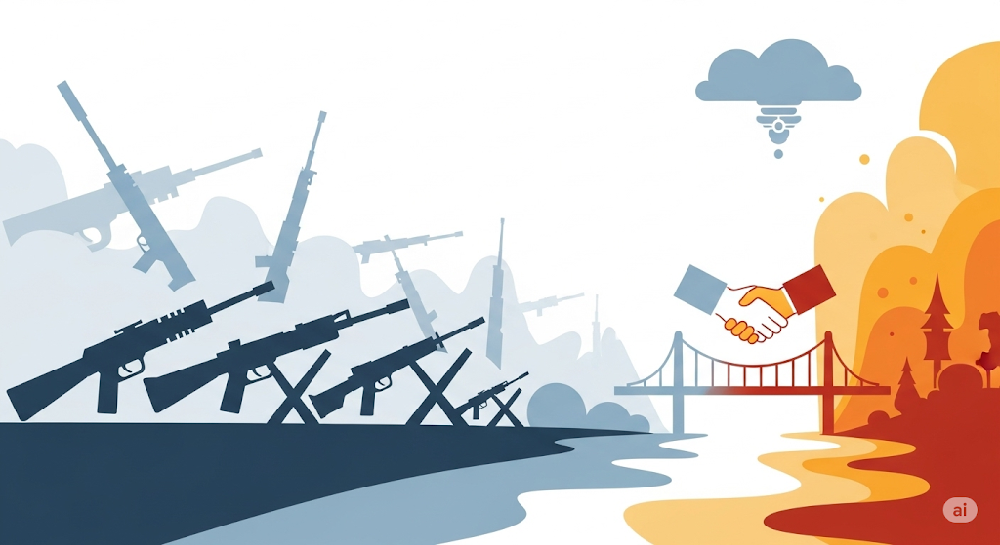

# Vrede is Nodig
{ align=right width="250" loading=lazy }
Het Westen moet dringend zijn strategie herdenken en zich richten op **vreedzame co-existentie met Rusland**, in plaats van te blijven streven naar een militaire overwinning in Oekraïne. Rusland heeft **legitieme veiligheidseisen en verlangens** die serieus genomen moeten worden. We moeten niet vergeten dat na de Tweede Wereldoorlog Frankrijk en Duitsland ook vrienden zijn geworden; een vergelijkbare toenadering met Rusland zou mogelijk moeten zijn.

De huidige focus op oorlog en escalatie is gevaarlijk en kan leiden tot een **kernoorlog**, met rampzalige gevolgen voor iedereen. De wereld staat op een kantelpunt, met toenemende spanningen in Oekraïne, het Midden-Oosten en rond Taiwan. Hoewel het "establishment" zich verzet tegen de groeiende onvrede onder de bevolking, is deze trend niet te stoppen. Het wordt tijd dat het Westen zich **geestelijk voorbereidt op vrede en diplomatie**, in plaats van uitsluitend op oorlog.
