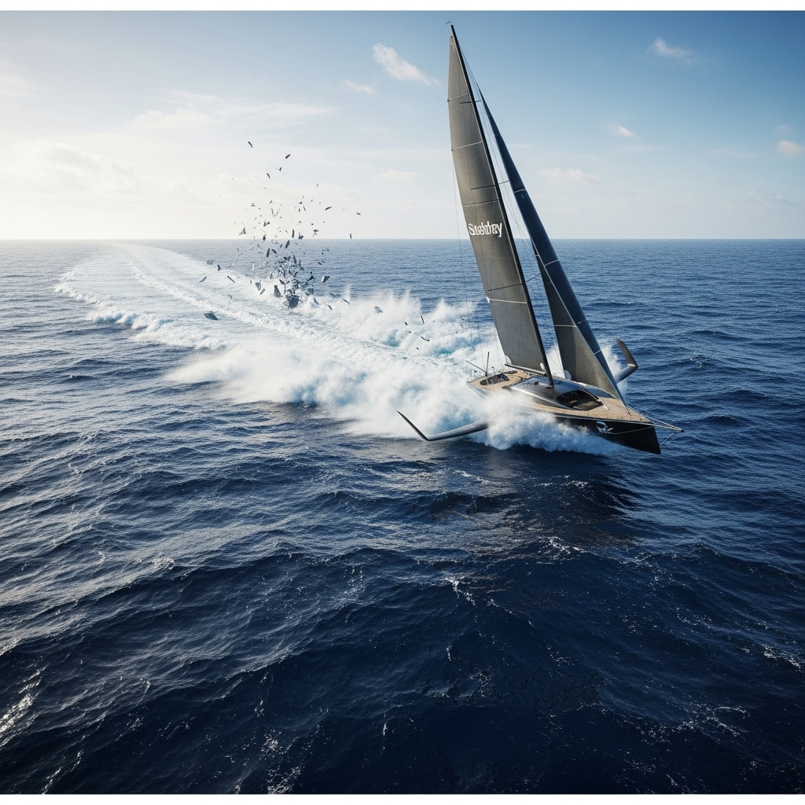

{ align=right width="250" }

Ever wondered what happens when you push the boundaries of sailing, throwing conventional rules out the window? This fascinating journey delves deep into the exhilarating world of marine engineering, exploring how sailors and engineers have continuously strived to conquer the waves, often against the very laws of physics. From the basic concept of "hull speed" to the cutting-edge designs of modern racing yachts, this video reveals the relentless pursuit of speed on water.

<!-- more -->

The adventure begins by unraveling the foundational concept of hull speed, a theoretical limit that traditional displacement boats face, determined by their length. For centuries, this barrier seemed insurmountable, dictating the maximum velocity a ship could achieve. However, human ingenuity, driven by the thrill of competition and the desire for faster transport, led to groundbreaking innovations. The video traces the exciting rise of racing yachts and the intense evolution of the America's Cup, a crucible of design and engineering where every rule and limitation was rigorously tested and often circumvented.

But what happens when you truly break past hull speed? The video takes us into the chaotic realm of cavitation – the formation of vapor bubbles in a liquid due to pressure changes, which can lead to significant drag and even damage. This seemingly insurmountable obstacle pushed engineers to think outside the box, leading to revolutionary designs. One of the most astounding examples is the "Sailrocket," a futuristic vessel that defies traditional boat shapes to achieve astonishing speeds, essentially flying on water and leaving the cavitation barrier in its wake. This incredible feat highlights the power of unconstrained thinking in engineering.

Ultimately, this exploration isn't just about sailing fast; it's a testament to human curiosity and the drive to innovate. It showcases how challenging assumptions and pushing against perceived limits can lead to breathtaking advancements, redefining what's possible on the open water. The future of fast sailing promises even more radical designs as engineers continue to harness the forces of nature in ever more ingenious ways.

Catch the full exhilarating breakdown here: [What if sailing had no rules?](https://youtu.be/kk4AV3d4v3E?si=SzPPe_yls8SfusR-)