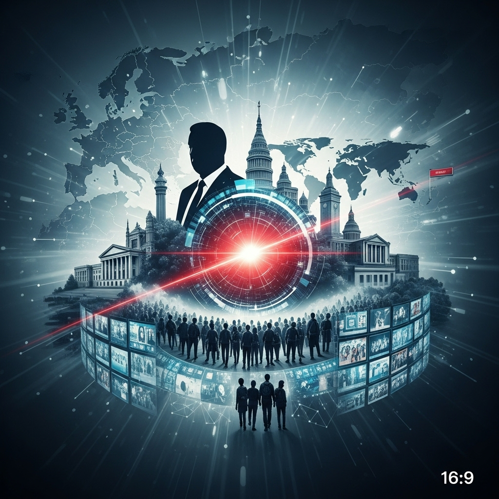

{ align=right width="250" }

Get ready for a deep dive into the week's most pressing topics as Rogier, Ad, and Kees from De Nieuwe Wereld TV pull back the curtain on everything from political intrigues to societal shifts. This lively discussion tackles a range of hot-button issues, providing insights and perspectives that will keep you on the edge of your seat. It's not just news; it's a conversation about the forces shaping our world.

<!-- more -->

First up on the agenda is the much-talked-about lobbying scandal surrounding Frans Timmermans, unraveling the complexities and implications of this high-profile case. The discussion then pivots to the fascinating interplay between the judiciary and the concept of depoliticization, questioning how politics influence the scales of justice. The conversation also introduces us to Arno van Kessel and the autonomous movement, exploring their ideas and impact.

A significant portion of the video is dedicated to the ever-relevant topic of immigration and its profound implications for the future of the Netherlands. The hosts delve into the multifaceted challenges and opportunities associated with demographic changes. No current events discussion would be complete without a mention of international affairs, and this episode touches upon Volodymyr Zelensky and the ongoing situation in Ukraine, offering brief updates and analyses. Furthermore, the rising influence of the AfD party and the concept of remigration are scrutinized, sparking a debate about national identity and policy directions. Finally, the role and impact of the media are put under the microscope, encouraging viewers to critically assess the information they consume. De Nieuwe Wereld TV, founded by philosopher Ad Verbrugge, continues to be a crucial platform where various disciplines converge to discuss the rapid changes brought by technological advancements and globalization.

You can watch the full discussion and get all the insights directly from the source here: [https://youtu.be/f8K_v-ckgC8](https://youtu.be/f8K_v-ckgC8)