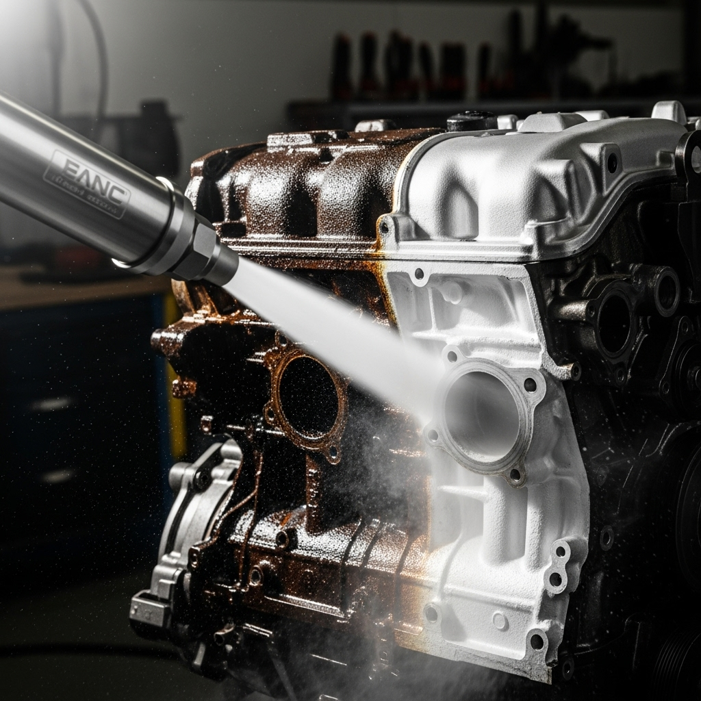

{ align=right width="250" }

Ever wondered how to achieve an exceptionally deep clean, making surfaces look brand new without harsh chemicals or abrasive scrubbing? This video takes a fascinating "Deep Dive Into Cleaning With Dry Ice," exploring the powerful and efficient world of dry ice blasting using Kärcher and Dry Ice Energy machines. Whether you're a seasoned professional in automotive detailing or industrial cleaning, or simply curious about advanced cleaning techniques, this guide provides a comprehensive overview of everything you need to know.

<!-- more -->

The video meticulously breaks down the mechanics of dry ice blasting, explaining "How Dry Ice Blasting Works" and the science behind its effectiveness. It covers essential "Air Requirements & Setup" for safe and optimal operation, ensuring you understand the practical considerations before diving into this powerful cleaning method. Furthermore, it showcases "Different Machine Options & Features" from leading brands like Kärcher and Dry Ice Energy, helping viewers choose the right equipment to suit their specific cleaning needs, from intricate automotive parts to heavy industrial machinery. This truly is the ultimate guide to mastering dry ice cleaning, promising to elevate your cleaning game to a whole new level.

Original video: [https://youtu.be/exDnPsVFV-k?si=cKBaj4PQxo8L0ec_](https://youtu.be/exDnPsVFV-k?si=cKBaj4PQxo8L0ec_)