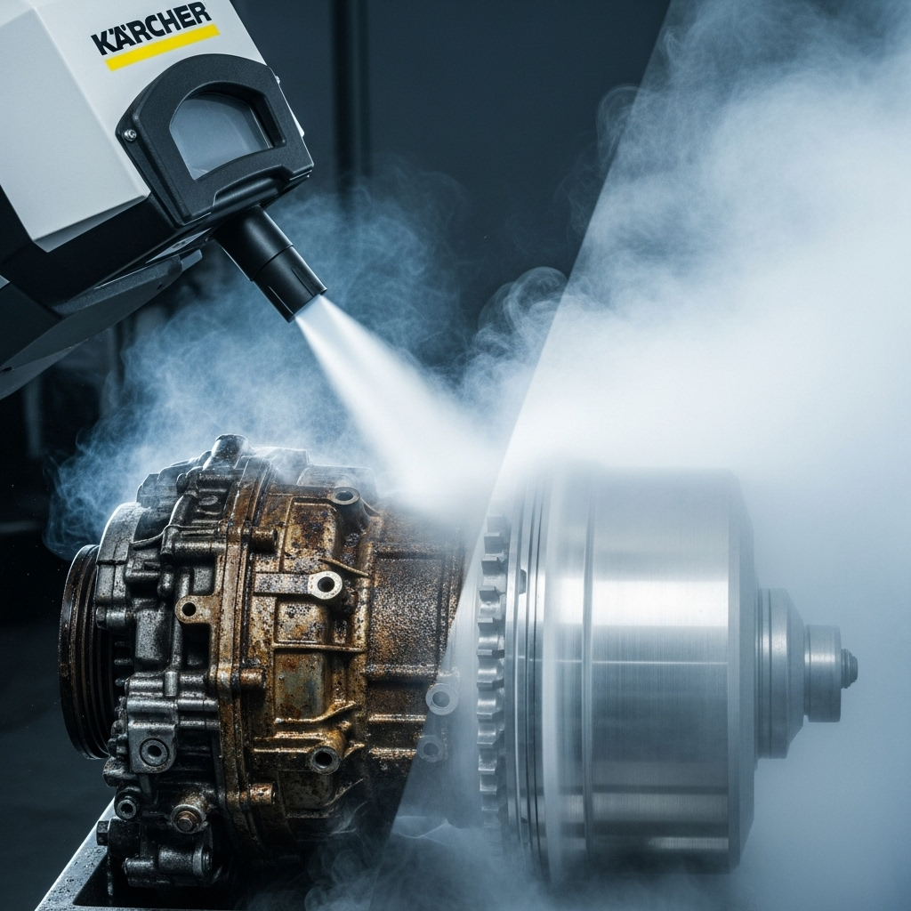

{ align=right width="250" }

Are you ready to chill out with your cleaning routine? This video takes you on an exhilarating "Deep Dive Into Cleaning With Dry Ice"! Whether you're a novice looking to understand the frosty magic of dry ice blasting or a seasoned pro aiming to sharpen your skills, this guide is packed with everything you need to know. We're talking about the nitty-gritty of how dry ice blasting works, the essential air requirements and setup, and a fascinating comparison of different machine options from Kärcher and Dry Ice Energy. Get ready to transform your cleaning game, making it quicker, more efficient, and surprisingly satisfying!

<!-- more -->

This comprehensive guide is a must-watch for professionals in automotive detailing, industrial cleaning, or equipment maintenance. Discover the ins and outs of choosing the perfect dry ice blaster to meet your specific needs. From removing stubborn grime to tackling delicate surfaces, dry ice cleaning offers a powerful, non-abrasive, and eco-friendly solution that leaves no secondary waste. The video breaks down the technical aspects into easy-to-understand segments, ensuring you grasp the core principles and practical applications. Learn about the nuances of air pressure, nozzle types, and the optimal handling of dry ice pellets to achieve impeccable results every time.

Beyond the technicalities, the video also touches on where to seek expert consultation, opportunities for advanced training to elevate your detailing prowess, and services for professional detailing and protection. So, if you're keen on leveling up your cleaning techniques and exploring the incredible potential of dry ice, this deep dive is your ultimate starting point. Prepare to be amazed by the cleaning power of frozen CO2!

Original video: [https://youtu.be/exDnPsVFV-k?si=cKBaj4PQxo8L0ec_](https://youtu.be/exDnPsVFV-k?si=cKBaj4PQxo8L0ec_)