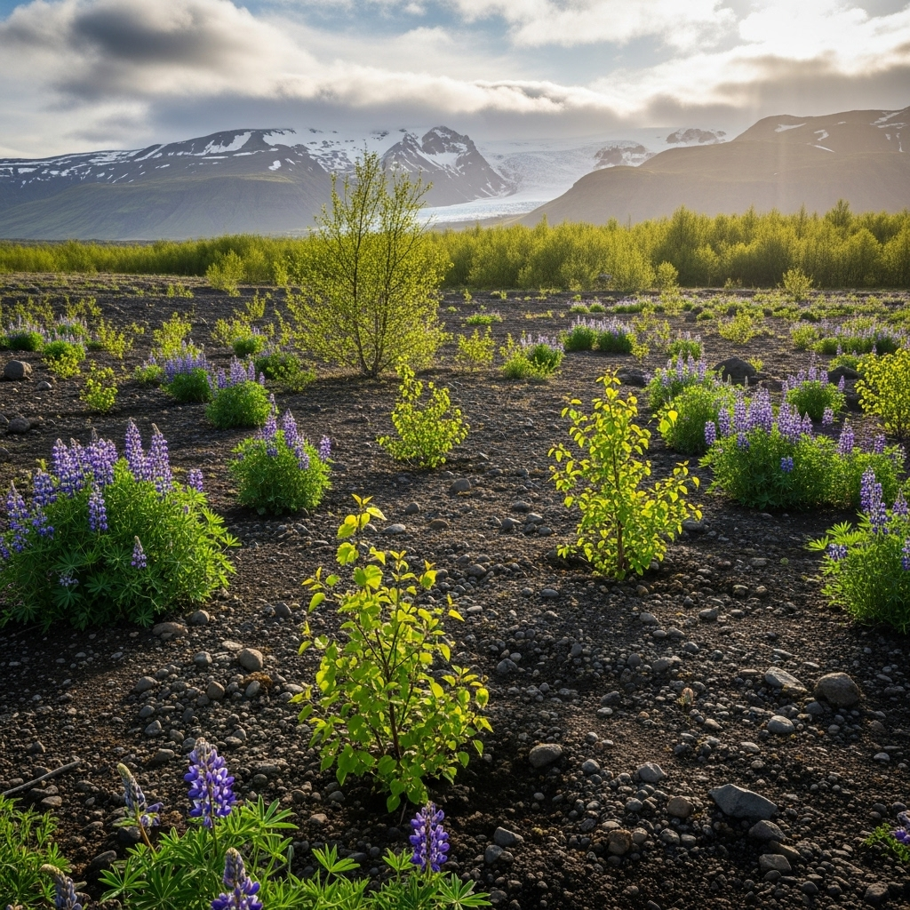

{ align=right width="250" }

Embark on a fascinating journey to Iceland, where Mossy Earth is tackling the monumental task of reclaiming the island's vast deserts. This video delves into a crucial rewilding project focused on restoring Iceland's native birchwoods, a vital part of its ecological heritage. Once covering a significant portion of the landscape, these resilient woodlands, offering shelter, food for biodiversity, and crucial soil stabilization, have dwindled to a mere 1% of their former glory. Join us as we explore the challenges and innovative approaches to bringing these essential ecosystems back to life.

<!-- more -->

The project, located about 120km east of Reykjavik in the southern uplands, is a collaborative effort with the Iceland Forest Service and private landowners. It addresses a critical need, as natural succession in these harsh volcanic and glacial environments could take centuries or even millennia. A significant aspect highlighted in the video is "The Lupine Question" – the complex role of the Nootka lupine. While this introduced species has been used for its soil-stabilizing and nitrogen-fixing properties, its potential to hinder the re-establishment of native birch is a nuanced debate. Mossy Earth navigates these ecological complexities, aiming for a balanced and sustainable restoration that fosters true biodiversity and rewilds Iceland's unique landscapes.

This initiative isn't just about planting trees; it's about restoring a complete ecosystem, enhancing carbon sequestration, and creating windbreaks to protect the fragile soil. By supporting this project, members are directly contributing to the long-term health and biodiversity of Iceland, demonstrating that even reclaiming deserts is a task we can tackle together.

Original video: [https://youtu.be/w-pT56a5ZUc?si=n4GJ-GGumv76X6of](https://youtu.be/w-pT56a5ZUc?si=n4GJ-GGumv76X6of)