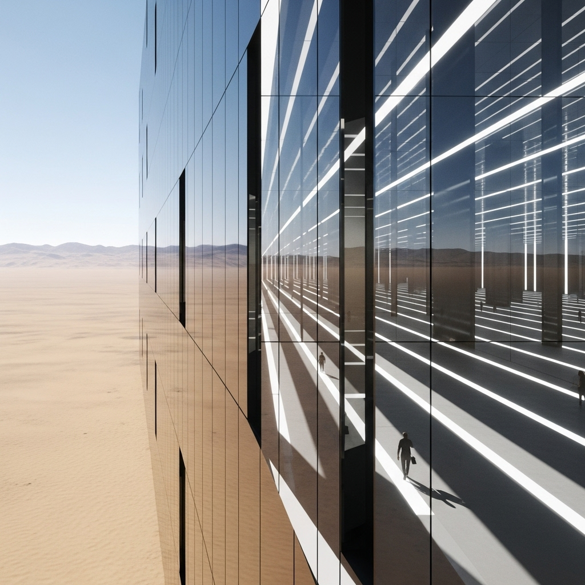

{ align=right width="250" }

Saudi Arabia's ambitious Neom project, particularly "The Line," presents a vision of a hyper-modern, linear city unlike anything ever conceived. Stretching an astounding 170 kilometers, this mirrored glass megastructure promises a revolution in urban living, aiming to eliminate cars, roads, and carbon emissions. However, a closer architectural analysis reveals that beneath its sleek, futuristic facade, "The Line" might be less of a utopian marvel and more of a meticulously designed trap, facing fundamental challenges that could lead to its ultimate failure.

<!-- more -->

The video delves into three critical areas, starting with **Urban Sprawl** and its inverse in "The Line." While traditional cities struggle with outward expansion, "The Line's" extreme linearity creates a different kind of constraint. The video suggests that confining millions within a narrow, vertical prism could lead to psychological challenges, limiting organic growth and the natural evolution of community spaces. The reliance on internal high-speed transit, while innovative, also raises questions about its capacity, resilience, and the sheer monotony of navigating a perpetually enclosed environment.

Next, the analysis tackles **Liveability**, examining the practicalities of daily life within this futuristic marvel. Questions arise about natural light, ventilation, and the psychological impact of living in a city where the natural world is largely experienced through reflective glass or carefully curated internal spaces. The video explores whether the proposed solutions, such as vertical farming and integrated services, can truly compensate for the loss of diverse urban landscapes and spontaneous interactions found in traditional cities. The highly controlled and planned nature of "The Line" could stifle individuality and limit the vibrant, unpredictable elements that make cities truly dynamic and engaging.

Finally, the video critically examines the pursuit of **Perfection**. "The Line" embodies a top-down, engineered approach to urban design, striving for an idealized state. However, the video argues that true urban success often emerges from organic development, adaptation, and the diverse needs of its inhabitants. Designing a city from scratch with such rigid parameters might overlook unforeseen human needs and environmental complexities, creating a sterile rather than sustainable future. The immense logistical, environmental, and human costs of building such a monumental structure, coupled with its inherent inflexibility, lead to the conclusion that "The Line's" promise of perfection might be its greatest flaw, setting it on a path toward an inevitable architectural and social struggle.

Ultimately, while "The Line" is a fascinating architectural experiment, this analysis suggests that its grand vision might be fundamentally at odds with the complex, messy, and wonderfully unpredictable nature of human life and urbanism. The video encourages us to consider whether the future of cities lies in imposing rigid, perfect designs, or in fostering adaptable, human-centered environments that evolve with their communities.

Original video: [Original video: https://youtu.be/c-jtIRvmbsk?si=Rty900PMtFkRHrI3](Original video: https://youtu.be/c-jtIRvmbsk?si=Rty900PMtFkRHrI3)