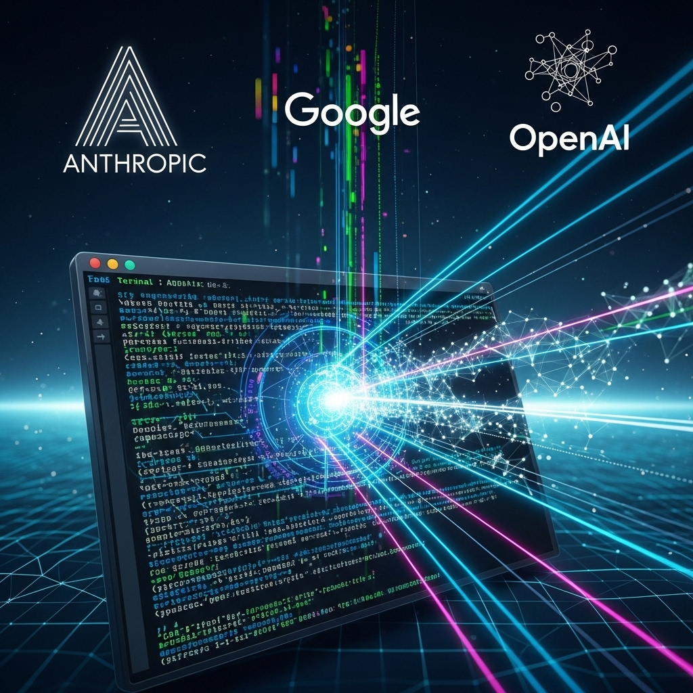

{ align=right width="250" }

Have you noticed the sudden resurgence of Command Line Interfaces (CLIs) in the AI world? It seems like every major AI player, from Claude Code and Gemini CLI to OpenAI's Codex and even Cursor, is making a strategic pivot back to the terminal. If you're wondering why this 'return to terminal' is happening and what it means for developers, you're in the right place! This isn't just a nostalgic trip; it's a deliberate and calculated move by some of the biggest names in AI, and it's set to redefine how we interact with these powerful models.

<!-- more -->

This video dives deep into the strategic rationale behind this shift. It's not about reliving the glory days of green-on-black screens; it's about efficiency, control, and the power of 'agentic loops.' These agentic loops are the secret sauce, allowing AI models to execute tasks, observe results, and iterate on their approach within a structured, repeatable environment – a perfect fit for the terminal's capabilities.

Major companies like Anthropic, Google, and OpenAI are pouring resources into CLIs because these terminal engines are becoming the foundational backbone for almost every other AI interface. Think about it: IDE plugins, web applications, and even advanced coding assistants are leveraging these terminal-based execution environments to provide seamless and powerful interactions. This centralized, robust foundation ensures consistency and scalability across diverse platforms.

So, do you need to become a terminal wizard to keep up with the latest AI advancements? Not necessarily, but understanding this underlying shift is crucial. The video unpacks how this movement began and what's on the horizon, offering a comprehensive look at how AI is leveraging the command line to build more capable and versatile tools. It's a fascinating look at the evolving landscape of AI development and the strategic thinking driving these innovations.

Original video: [Original Video: [The Real Reason AI Is Going Back to the Terminal](https://youtu.be/RvQII_5Puzw?si=nsQCSVTWrh3BzI_G)](Original Video: [The Real Reason AI Is Going Back to the Terminal](https://youtu.be/RvQII_5Puzw?si=nsQCSVTWrh3BzI_G))