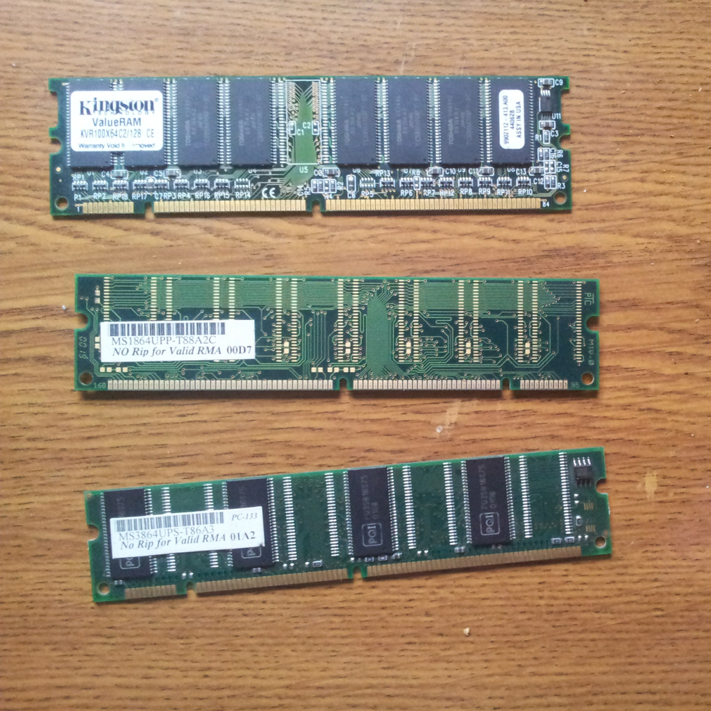

{ align=right width="250" }

If you've shopped for RAM or a new SSD lately, you've probably felt a sting. The same 32 GB DDR5 kit that cost a comfortable amount a year ago now costs noticeably more, and that 2 TB NVMe drive you had your eye on keeps creeping up in price. This isn't your imagination or a supply chain blip — 2026 is witnessing one of the most dramatic memory price rallies in the industry's history, and it all traces back to one thing: AI.

<!-- more -->

### The AI Memory Boom

Artificial intelligence is devouring memory at an unprecedented scale. Every AI accelerator — from NVIDIA's GPUs to custom inference chips — relies on High Bandwidth Memory (HBM), the ultra-fast stacked memory that feeds models their data. Demand for HBM has exploded so much that the three memory giants (Samsung, SK Hynix, and Micron) are reallocating their production capacity toward the high-margin HBM stacks used in data centers, squeezing the supply of conventional DRAM and NAND flash used in your laptop, phone, and server.

In short: the wafers that used to become your DDR5 modules and SSD chips are increasingly being turned into AI memory instead.

### The Numbers Are Staggering

The price action over the past year has been historic. TrendForce expected average DRAM prices to rise between 50% and 55% in Q1 2026 alone, and contract prices for conventional DRAM were projected to climb another 58–63% in Q2 2026 after that historic rally. J.P. Morgan Global Research estimates DRAM prices will have risen more than 400% from the start of 2024 to the end of 2026.

NAND flash is following the same trajectory — in Q2 2026, NAND contract prices were expected to jump 70–75% quarter-over-quarter, actually outpacing DRAM for the first time in this cycle. Analysts have even coined a term for it: "memflation." One estimate puts the year-over-year increase at roughly 125% for DRAM and a stunning 234% for NAND flash, meaning a storage array quoted at the end of 2025 costs more than double to provision by the end of 2026.

### Who Feels the Pain

The effects ripple through the entire industry. PC and smartphone makers are facing sharply higher component costs, which IDC warns will reshape specs and pricing across the 2026 device market — think less RAM in budget phones, or higher price tags for the same specs. Data center operators are seeing their build-out costs balloon, which eventually trickles down to the price of cloud services. Even the automotive and IoT sectors, which rely on mature-node memory, are feeling the squeeze as manufacturers deprioritize those lines.

And then there's the consumer. Enthusiasts building a new PC are facing RAM and storage costs that can rival the CPU, and the secondhand market has turned into a frenzy of its own.

### Signs of Cooling

There is some relief on the horizon. By Q3 2026, the surge has begun to slow as consumers hit their affordability limits: TrendForce projects conventional DRAM contract prices to rise a "modest" 13–18% quarter-over-quarter, with NAND flash up 10–15% — substantial gains, but a marked slowdown compared to earlier in the year.

Still, this is a slowdown, not a reversal. The structural driver — AI capex and HBM's share of fab capacity — remains firmly in place. As long as data center spending keeps growing, conventional memory will keep competing for wafer space.

### What Should You Do?

If you've been postponing a RAM or storage upgrade, there's a reasonable case for buying sooner rather than later. Prices may keep climbing through the rest of 2026, even if at a gentler pace. Keep an eye on contract-price reports, shop around, and consider locking in components before your next build — memory has quietly become one of the most expensive parts of a modern system.

### Sources

- [CNBC: AI memory is sold out, causing an unprecedented surge in prices](https://www.cnbc.com/2026/01/10/micron-ai-memory-shortage-hbm-nvidia-samsung.html)
- [S&P Global: AI memory boom squeezes legacy DRAM supply](https://www.spglobal.com/market-intelligence/en/news-insights/research/2026/01/ai-memory-boom-squeezes-legacy-dram-supply-pushing-prices-higher)
- [J.P. Morgan: The AI-Driven Memory Shortage](https://www.jpmorgan.com/insights/global-research/artificial-intelligence/dram-memory-shortage-from-ai)
- [NAND Research: Memory & NAND Flash Crisis — May 2026 Update](https://nand-research.com/memory-nand-flash-crisis-may-2026-update/)
- [Tom's Hardware: Memory price surge begins to cool](https://www.tomshardware.com/pc-components/ram/memory-price-surge-begins-to-cool-as-consumers-hit-affordability-limit-ai-demand-still-keeps-dram-and-nand-prices-climbing-through-q3-2026)
- [IDC: Global Memory Shortage Crisis](https://www.idc.com/resource-center/blog/global-memory-shortage-crisis-market-analysis-and-the-potential-impact-on-the-smartphone-and-pc-markets-in-2026/)
- [Elecinsight: DRAM & NAND Flash Price Trends 2026](https://www.elecinsight.com/news/dram-nand-flash-price-trends-market-analysis-procurement-strategies)
- [Image: SDRAM memory module — Wikimedia Commons (CC0)](https://commons.wikimedia.org/wiki/File:SDRAM_memory_module.jpg)
