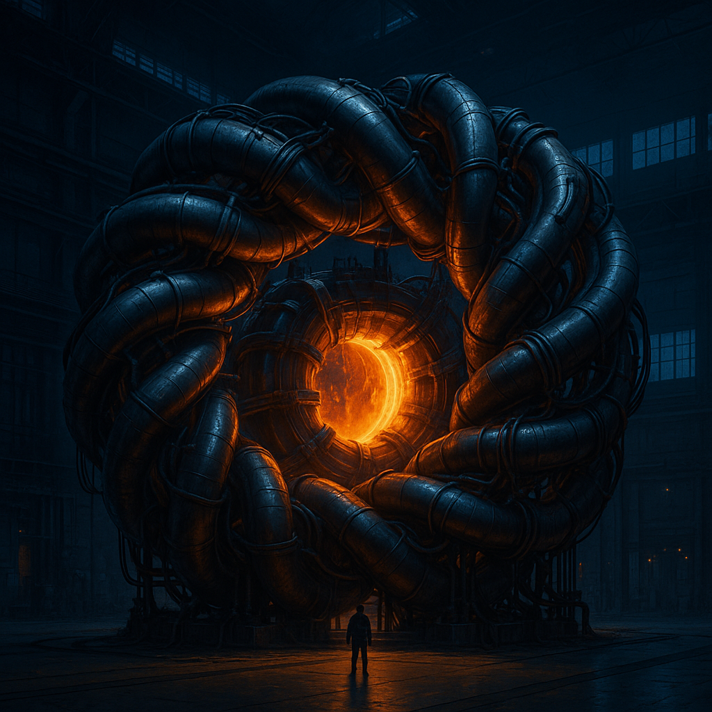

{ align=right width="250" }

For fifty years, the tokamak — the classic donut-shaped reactor — has dominated fusion research. Now a Munich startup called Proxima Fusion, spun out of the Max Planck Institute and freshly funded with €411 million including checks from Google and energy giant RWE, is betting everything on the shape the field walked away from half a century ago: the stellarator, a "donut with a twist" so absurdly complicated it was long believed impossible to build. This is the story of why fusion is so hard, why the tokamak has a fatal flaw, and how Europe's most ambitious energy bet plans to build the first stellarator power plant in history.

<!-- more -->

### Why Building a Star on Earth Is Basically Impossible

Fusion is conceptually simple: slam two light atomic nuclei together hard enough that they fuse into one heavier nucleus, releasing a fast neutron and a tremendous amount of heat. The Sun does this with gravity alone, squeezing hydrogen in its core until fusion simply happens. On Earth we have no star's worth of gravity, so we brute-force it with temperature — heating hydrogen to between 100 and 150 million degrees Celsius, about ten times hotter than the core of the Sun. At that temperature atoms are ripped apart into plasma, and no material on Earth can touch it without vaporizing instantly. So the plasma is held suspended in a magnetic field — and the plasma must be hot, dense, and held together long enough *at the same time*: the "triple product" that has defined fusion research for decades.

### The Donut Problem

The simplest magnetic cage is a row of ring magnets forming a tube, which leaks at both ends — so you loop the tube into a donut, a torus. But the torus has a subtle flaw: the magnetic field is stronger on the inside of the donut hole and weaker on the outside. Ions spiraling along the field lines creep vertically with every lap, positive ions drifting one way, electrons the other. That charge separation effectively builds a capacitor out of a 150-million-degree cloud of plasma, creating an electric field that pushes the ions outward toward the sidewalls — where they would dump 150 million degrees into a few centimeters of metal. The fix is to make the magnetic field lines themselves spiral as a helix, so the drift cancels out over each lap. All of magnetic fusion boils down to a single question: *how do you make that twist?*

### The Stellarator: An Idea Before Its Time

In 1951, Princeton astrophysicist Lyman Spitzer sketched the answer on an envelope during a chairlift ride in Aspen: the stellarator, a star generator, which contorts the whole plasma into a twisted geometry so the field lines helix on their own. Princeton spent the next 15 years discovering how wide the gap between an envelope sketch and a working star really is. Their machines leaked plasma hundreds of times faster than theory predicted — a stellarator only works if the helical field is shaped almost perfectly, and 1950s engineering couldn't wind those coils by hand to the required tolerances. Then in 1968 the Soviets announced the T-3 tokamak was holding plasma at over 10 million degrees, 30 times better than anything in the West — verified by a British team that flew lasers to Siberia mid-Cold War. The tokamak achieved the twist by running a current through the plasma itself, using only a simple symmetric ring of magnets and a central solenoid. Within five years nearly every stellarator program on Earth had been shut down or converted.

### The Tokamak's Fatal Flaw

The tokamak's trick has a flaw welded into its bones: a transformer only works while the current is changing. The solenoid ramps up, holds, then must be discharged and ramped again — so every tokamak power plant runs in pulses. ITER, the largest fusion project on the planet, aims for headline burns of around 400 seconds, under seven minutes, before it needs a timeout. For a science experiment that is fine; for a power plant it is detrimental. Each pulse is a full thermal cycle — tens of thousands of them over a plant's life, stressing the reactor structure and giving material scientists night terrors — and a plant that spends part of its life cooling down isn't generating revenue. What if there were a way to build a reactor you never had to turn off?

### The Computer Comes to the Rescue

While the world converted its stellarators into tokamaks, a group at the Max Planck Institute outside Munich quietly kept working. Their reasoning: the stellarator hadn't been disproven, it just hadn't been built well enough yet. With no plasma current to help, the entire job of confinement falls to the external coils — the field has to be right everywhere, all at once, in an absurdly large design space. By 1988 their first computationally optimized design, the Wendelstein 7-AS, proved the concept could confine plasma without the leak that had haunted stellarators for decades. Then came the landmark W7-X, built from 50 non-planar superconducting coils in five identical modules, each bent to its own computer-optimized contorted 3D shape — more than a billion euros, two decades, and over a million hours of assembly. Its field surfaces nest like Russian dolls, and its *quasi-isodynamic optimization* ensures that even trapped particles bouncing between magnetic mirrors drift one way on the first half of their bounce and exactly back on the second, net movement zero. After first plasma in 2015, W7-X set world-class records: 1.02 megajoules stored energy at over 29 million degrees in 2018, and in February 2023 a 40-million-degree plasma held for a full eight minutes. Stellarators, for the first time, had a real line in the sand. But W7-X runs on ordinary hydrogen and helium — not real fusion fuel — and can never produce more energy than it consumes. It proved the physics; it can't sell the electricity.

### Proxima's Cheat Code: Stronger Magnets

That's where Francesco and Proxima enter. Founded in 2023 as a spin-out from Max Planck, the company's plan is to take W7-X's physics and make it economical — using the one lever nobody had pulled: magnet strength. Fusion power scales as the *fourth power* of the magnetic field: double the field, get 16 times the power from the same plasma volume; triple it, 81 times. But W7-X's niobium-titanium magnets quench — lose superconductivity and melt — if pushed much past 12 tesla. The breakthrough came from MIT and Commonwealth Fusion Systems: REBCO, a rare-earth barium copper oxide that stays superconducting up to 90 K and survives 20 tesla. The catch: REBCO is a brittle ceramic that doesn't bend — and a stellarator coil is one of the most contorted shapes in engineering. Proxima's answer is a flexible superconducting tape: a thin ribbon of Hastelloy with a 1–2 micrometer REBCO film grown on it atom by atom, yielding a cable about a centimeter across that carries up to 50 kiloamps — something that would need a 40 cm copper wire to replicate. The result is a stellarator design at around 9 tesla on-axis versus W7-X's 2–3: 81 times the potential fusion power output. The winding technique itself is so proprietary that the video host wasn't even allowed to film in the same room as it.

### The Roadmap: 2027, Alpha, and 50 Plants by 2050

The plan is concrete. In the second half of 2027, Proxima tests a full-scale model coil — by most measures the most advanced magnet ever attempted — built between Munich and Zurich teams, designed to de-risk the technology before committing to the full reactor. Next is Alpha, a demonstration stellarator next door to the Max Planck Institute targeting net energy gain in the early 2030s: a roughly €2 billion project for which Bavaria has committed up to €400 million, matched and now exceeded by the private round. Proxima still needs around $1.2 billion more, with signals of intent from the German federal government. Alpha is meant to be the last test machine before the real thing — "Stellarator," slated for the late 2030s — and the stated ambition is 50 power plants by 2050. That sounds absurd until you remember France did almost exactly this with fission, going from nearly nothing in the 1970s to about three-quarters of its electricity from nuclear in two decades.

### More Than Electricity

A fusion plant is better understood as a platform than a product. Beyond decarbonized electricity, it produces high-temperature industrial heat — useful for smelting steel without carbon-emitting processes — and a byproduct almost nobody talks about: neutrons, needed to manufacture medical isotopes for imaging and cancer treatment. It also builds a domestic supply chain for high-temperature superconducting magnets and industrial cryogenics, technologies with uses stretching from MRI scanners to wind turbines. All of that makes the project look less like a single product and more like the building of a whole new economy — all starting and ending with humanity's oldest fascination: the power to capture a star.

### Sources

- Original video: [It's Happening - Europe is Building an Impossible Fusion Reactor](https://www.youtube.com/watch?v=bPUAKW1Dyek) (Dr Ben Miles)
- [Proxima Fusion](https://www.proximafusion.com/)
