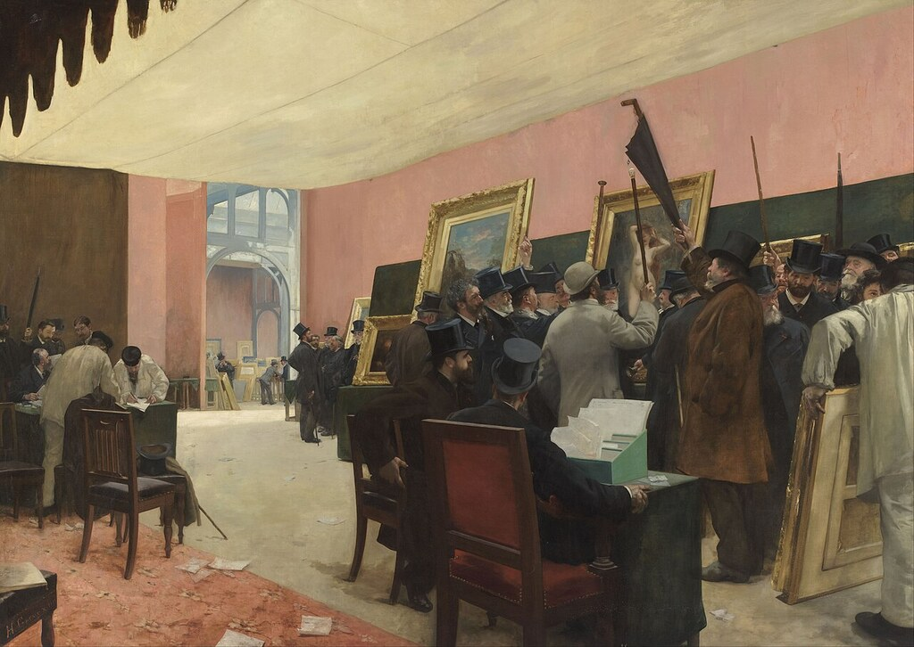

{ align=right width="250" loading=lazy }

For the better part of three centuries, Paris was the art capital of the Western world. But the ecosystem that made it so — the network of academies, juries, dealers, critics, collectors and exhibition spaces that decides who gets seen and who gets paid — was never static. It went through four distinct phases, each defined by a different gatekeeper: the royal court, the official Salon jury, the private art dealer, and finally the global market of fairs and mega-galleries. Tracing those phases explains not just how Paris became the home of modern art, but why it lost that crown — and why it is fighting for it again.

<!-- more -->

### Phase One: The Royal Academy and the Salon (17th–18th Century)

The story begins in 1648, when Cardinal Mazarin founded the Académie royale de peinture et de sculpture under Louis XIV. Under the painter Charles Le Brun, the Academy took near-total control of training, taste and royal commissions: it decided what good art was, taught it through its hierarchy of genres (history painting at the top, still life at the bottom), and sent its best students to Rome through the Prix de Rome.

Its public face was the Salon, the official exhibition held in the Louvre from 1725 and open to the public from 1737. In this phase the gatekeeper was the state itself. A place at the Salon signalled royal favour; rejection could end a career before it began. For an artist, the ecosystem was simple: the Academy trained you, the Salon showed you, and the crown paid you.

### Phase Two: The Salon's Golden Age and the Birth of the Avant-Garde (19th Century)

Between 1748 and 1890 the Salon was arguably the greatest art event in the Western world — tens of thousands of visitors, hundreds of paintings hung floor-to-ceiling. But its jury grew conservative, and in 1863 it rejected an unusually large number of works. Napoleon III responded with the Salon des Refusés, showing the rejected paintings alongside — widely seen as the birth of the avant-garde. Gustave Courbet had already built his own "Pavilion of Realism" at the 1855 World's Fair, and in 1874 the Impressionists staged their first independent exhibition in the studio of photographer Nadar on the Boulevard des Capucines, followed by seven more through 1886.

The real shift, though, was economic. Dealers like Paul Durand-Ruel and Georges Petit began buying up the "rejected" artists, giving them income and exhibitions independent of the state. When the government withdrew from the Salon in 1881 and the institution split in 1890, the Academy's monopoly was effectively over. The new gatekeepers were private dealers, supported by a growing corps of critics. Meanwhile Paris, rebuilt by Haussmann and connected to the rest of Europe by rail, pulled in artists from everywhere — by one estimate, one in five Dutch artists between 1789 and 1914 spent time in the city.

### Phase Three: The Dealer-Gallery System and the Loss of the Crown (1900–1960s)

In the early twentieth century, the ecosystem matured into the dealer-gallery system we still recognise. Montmartre and then Montparnasse filled with painters and sculptors from across Europe; Pablo Picasso, Amedeo Modigliani and Chaim Soutine sold through dealers like Ambroise Vollard, Daniel-Henry Kahnweiler — who wrote pioneering contracts with the Cubists — and the Rosenberg brothers. Collectors such as Gertrude Stein and her family made the city a marketplace for the new.

Then came the transfer of power. After the Second World War, New York overtook Paris as the centre of the art world, with Abstract Expressionism and its "action painting" championed by a new generation of American critics and dealers. The Dutch writer Joost Zwagerman captured the reversal perfectly: "Vroeger trok je naar Parijs om de toekomst naar je hand te zetten. Vijftig jaar later beland je in Parijs om je verleden uit te breiden." (Once you went to Paris to shape the future; fifty years later you went to Paris to extend your past.) Paris kept producing art, but the market and the myth had moved across the Atlantic.

### Phase Four: Globalization, Fairs and a Parisian Revival (1970s–Today)

From the 1970s the ecosystem went global. The Centre Pompidou opened in 1977, and the Foire Internationale d'Art Contemporain (FIAC) was founded in 1974, making Paris an early home of the modern art fair. But the real centre of gravity was now the international circuit: fairs, mega-galleries and auction houses, with prices set in New York, London and Hong Kong.

Paris has spent the past decade clawing back its position. Private institutions led the way: the Fondation Louis Vuitton (2014) and the Bourse de Commerce – Pinault Collection (2021) gave the city world-class contemporary spaces. Then came the fair market: FIAC's final edition was held in 2022, replaced by Paris+ par Art Basel, launched in October 2022 and renamed Art Basel Paris in 2024. Its fifth edition takes place from 23 to 25 October 2026 in the restored Grand Palais — the first under new director Karim Crippa. The gatekeeper has changed again: today the power lies with a global network of fairs, collectors and institutions, and Paris is once again bidding to be at its centre.

### What the Four Phases Tell Us

Each phase moved the power to decide what art is worth one step further from the artist: from the monarch's court, to the state jury, to the private dealer, to the global market. The ecosystem that made Paris the capital of art for centuries was not a single invention but a series of reinventions — and the current revival shows the city is still willing to play that game.

### Sources

- [Wikipedia: Salon (Paris)](https://en.wikipedia.org/wiki/Salon_(Paris))
- [Wikipedia: Académie royale de peinture et de sculpture](https://en.wikipedia.org/wiki/Acad%C3%A9mie_royale_de_peinture_et_de_sculpture)
- [Wikipedia: French art salons and academies](https://en.wikipedia.org/wiki/French_art_salons_and_academies)
- [NPO Kennis: Waarom is Parijs zo aantrekkelijk voor kunstenaars?](https://npokennis.nl/longread/7865/waarom-is-parijs-zo-aantrekkelijk-voor-kunstenaars)
- [Art Basel: Paris — name, leadership team and selection committee](https://www.artbasel.com/stories/art-basel-announces-further-details-about-its-show-in-paris)
- [Art Basel Paris 2026 — 5th edition at the Grand Palais (October 23–25)](https://culturalsignal.com/fairs/art-basel-paris-2026)
- [Image: Henri Gervex, A Session of the Painting Jury — Wikimedia Commons (Public domain)](https://commons.wikimedia.org/wiki/File:Henri_Gervex_-_A_Session_of_the_Painting_Jury_-_Google_Art_Project.jpg)
