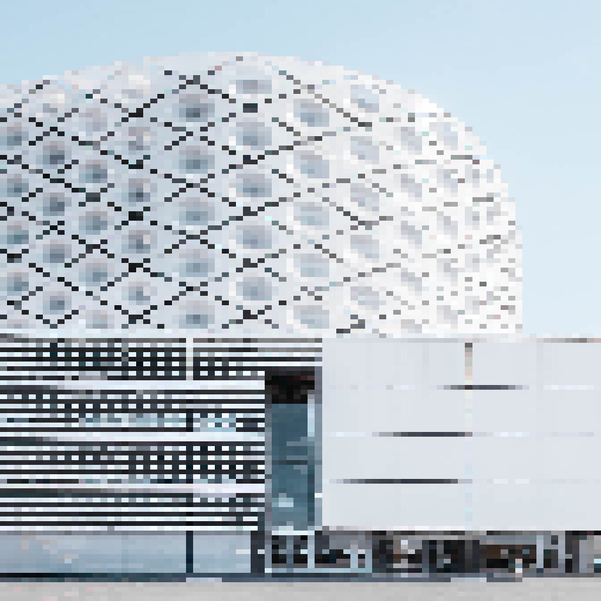

{ align=right width="250" loading=lazy }

Most organisations are designed in silos. The user experience team and the process architect speak different languages; the executive can't relate to the strategic product roadmap; the organisation designer can't see the impact of that tangled application architecture. The result is a fragmented enterprise with a fragmented design. EDGY is an open-source response to exactly that problem: a simple, graphical language that lets designers, architects and change-makers co-design the enterprise as a coherent whole.

<!-- more -->

### What Is EDGY?

EDGY is the Intersection Group's open-source tool for collaborative enterprise design. Its first release, "EDGY 23: Language Foundations", defined a common language made up of facets, enterprise elements and relationships, and it keeps evolving through annual releases. It was curated by Bard Papegaaij, Wolfgang Goebl and Milan Guenther — whose 2012 book "Intersection" laid the groundwork by founding enterprise design on the relationship between identity, architecture and experience.

EDGY deliberately does not replace the specialist languages already in use. Rather than competing with modelling standards such as ArchiMate, it complements them, aiming to stay simple, colourful, general-purpose and inviting enough that people from any discipline can join the conversation — and let their own specialists hook in where more precision is needed.

### The Three Facets

At the heart of EDGY are three universal facets — the lenses through which you can understand any enterprise, whether it is a multinational, a startup, a public institution or a non-profit:

- **Identity**: what the enterprise is about. Its story, purpose and mission, its culture and community, and the motivation of the people behind it.
- **Experience**: what you actually deliver and how it changes people's lives — the subject of customer and employee experience design.
- **Architecture**: what you need to realise it. The capabilities, processes, assets and information that make it work — the domain of enterprise and business architecture and operating-model design.

Historically these were treated by separate functions in separate silos, producing incoherent, underperforming enterprises. EDGY brings them under one roof.

### The Intersections: Where Disciplines Meet

The real power lies in the overlaps between facets — the intersections where disciplines collide and, ideally, connect:

- **Organisation** (Identity + Architecture): how the enterprise organises itself as a team, makes decisions and distributes responsibility — design, leadership and ways of working.
- **Product** (Architecture + Experience): what the enterprise makes and offers, and the value it creates — product strategy, service design and business models.
- **Brand** (Experience + Identity): how the enterprise is perceived and its reputation — branding, marketing and communications.

These intersections are the connectors that turn isolated specialist viewpoints into integrated, actionable perspectives.

### The Enterprise Elements and Tools

The language itself is built from a defined set of Enterprise Elements, grouped under the facets and intersections. Identity brings Purpose, Content, Story and Brand; Experience brings Task, Channel and Journey; Architecture brings Capability, Asset, Process, Organisation, Outcome and Object — alongside Product and People near the edges. Relationships and labels tie them together, and a growing catalogue of Enterprise Design Patterns (overview, impact, behavioural, practice and creations) guides how the elements are used.

To make it usable, EDGY ships practical tools: an Enterprise Scan for understanding your current state, capability modelling, an EDGY sandbox and pre-made design boards and templates for collaborative mapping.

### Why It Matters

The language is there to overcome exactly the kind of miscommunication that plagues change programmes. When the process architect ignores your well-researched customer journey map, or leadership can't see the point of the application architecture you spent months documenting, the problem is not lack of insight — it is a lack of a shared vocabulary. "To become whole, enterprises must embrace a holistic, collaborative way of design: transcending silos, combining perspectives, looking for connections instead of divisions," write the EDGY 23 curators. "An enterprise designed together works better together."

Getting started is deliberately low-friction: learn the facets and elements, map your enterprise, and run an enterprise scan to frame the challenge. EDGY won't replace your architecture repository or your UX research files, but it gives everyone a way to see the same whole — and to design it together.

### Sources

- [Enterprise Design with EDGY](https://enterprise.design/)
- [Intersection Group: Enterprise Design with EDGY](https://intersection.group/enterprise-design/enterprise-design-with-edgy/)
- [EDGY:About — wiki](https://enterprise.design/wiki/EDGY:About)
- [Milan Guenther — Intersection (book)](https://intersectionbook.com/)
- [Image: Geometric Building Madrid — Wikimedia Commons (CC0), pixelated](https://commons.wikimedia.org/wiki/File:Geometric_Building_Madrid_(Unsplash).jpg)
