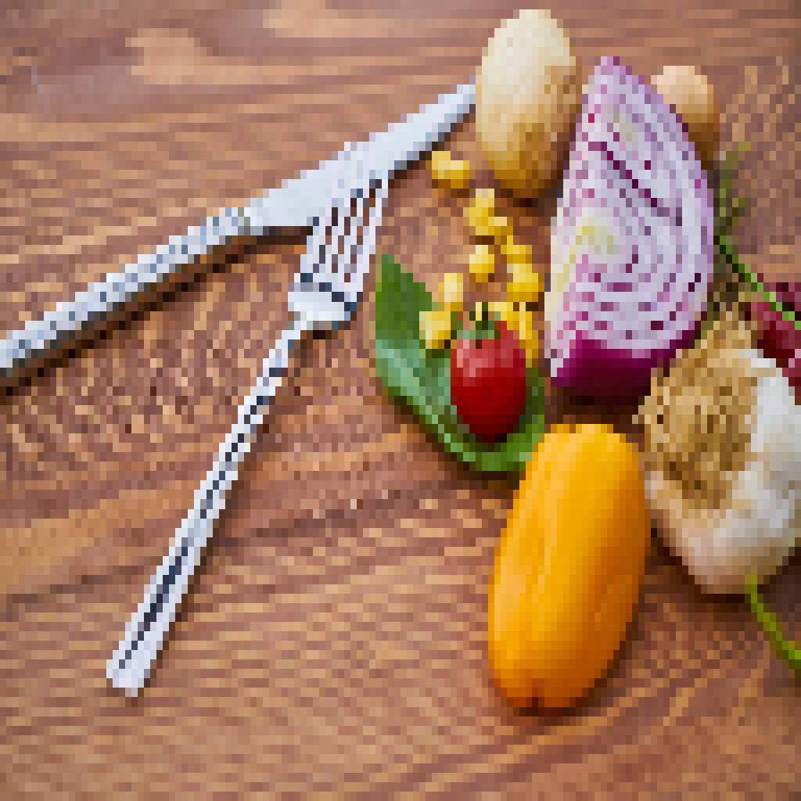

{ align=right width="250" loading=lazy }

Your metabolism is the sum of the biochemical processes by which your body turns food into energy. The common belief that slim people automatically have a "faster" burn than people with overweight is a myth: a heavier body needs more energy to function and has an absolutely higher resting calorie expenditure. Weight regulation comes down to total energy balance. So to understand how to influence what you burn, you first need to know what your Total Daily Energy Expenditure (TDEE) is made of.

<!-- more -->

### How Your Daily Energy Use Is Built

TDEE is the total number of calories you burn in a day. It has four components, each with a different share and a different degree of flexibility.

| Component | Share of TDEE | What it covers |
|---|---|---|
| **Basal/Resting metabolic rate (BMR/RMR)** | 60–75% | The energy for vital functions — heart, organs, cell repair — at complete rest. |
| **Non-Exercise Activity Thermogenesis (NEAT)** | 15–30% | All spontaneous, non-sport movement: walking, standing, housework, fidgeting. The most variable factor between individuals. |
| **Thermic Effect of Food (TEF)** | 8–10% | The energy the digestive tract spends digesting, absorbing and processing macronutrients. |
| **Exercise Activity Thermogenesis (EAT)** | 0–10% | Deliberate sport and structured training. |

The huge difference in flexibility is worth noting: BMR dominates but is hard to change quickly, while NEAT can vary enormously between two similar people and between one person's good and bad weeks.

### What Determines Your Resting Metabolism

Several factors set your BMR:

- **Body composition.** Fat-free mass (organs and muscle) burns far more energy per kilogram than fat tissue.
- **Body size.** A larger body surface and more total mass raise your absolute expenditure.
- **Age.** A large-scale study published in *Science* in 2021 found that metabolism (corrected for fat-free mass) stays stable between age 20 and 60 — then declines by roughly 0.7% per year after 60, closely tied to the loss of muscle mass.
- **Thyroid and hormonal status.** Serious deviations such as hypothyroidism can slow metabolism, though on their own they rarely explain major obesity.

### 8 Evidence-Based Ways to Optimize Your Daily Energy Use

**1. Raise your NEAT**

NEAT is the single biggest variable in your daily burn. Two people of the same weight can differ by hundreds of calories a day — in some studies up to around 800 — purely because of how they move during work and daily life. Stand a little rather than sit all day, take the stairs, walk short distances instead of driving or taking the bus, and build in short walk breaks during desk work.

**2. Do progressive strength training**

Resistance training stimulates the creation and retention of fat-free mass. Muscle burns roughly 13 kcal per kilogram per day at rest (versus about 4.5 kcal/kg for fat). Muscle is not a giant resting calorie-burner by itself, but strength training prevents the structural dip in BMR that a calorie deficit would otherwise cause, so it protects your metabolism while you lose weight.

**3. Prioritise protein**

The thermic effect of food differs sharply by macronutrient: protein costs 20–30% of its calories to digest, carbohydrates 5–10%, and fat just 0–3%. A higher-protein diet raises the TEF share of your TDEE, supports muscle retention during weight loss and increases satiety — a triple win.

**4. Integrate high-intensity interval training (HIIT)**

HIIT burns a lot of energy in a short time and produces a temporary post-exercise rise in oxygen consumption (EPOC, the "afterburn effect"). Popular media often oversell this — it typically amounts to a few dozen calories — but HIIT is a genuinely time-efficient stimulus for cardiovascular and metabolic fitness.

**5. Avoid overly aggressive deficits**

With a prolonged, very large calorie deficit your body adapts: spontaneous movement (NEAT) drops and metabolic efficiency rises slightly to save energy. This adaptive thermogenesis is the enemy of fat loss. A moderate deficit (300–500 kcal below maintenance) minimises that adaptation and protects your fat-free mass.

**6. Guard your sleep quality and duration**

Chronic short sleep (under seven hours a night) disrupts the hunger hormones ghrelin and leptin, boosting appetite and cravings for sugar. Fatigue also slashes spontaneous physical activity (NEAT), lowering your total daily expenditure indirectly — and it makes a long, comfortable session on the sofa look far more attractive.

**7. Use caffeine selectively**

Caffeine — in black coffee or green tea — stimulates the central nervous system and can temporarily raise energy expenditure and fat oxidation by around 3–5%. The effect is modest and you build tolerance with frequent use, so it is a marginal nudge at best, not a lever you should lean on.

**8. Prioritise consistency over quick fixes**

No supplement, special food or trick (cold water, "metabolism" teas, shake-it-off routines) will meaningfully or permanently raise your metabolism. The only physiologically proven routes to a sustainably higher burn are structural changes in your body composition — more muscle, less fat — combined with an active lifestyle. The evidence-based path is unglamorous: protein, progressive strength work, a moderate deficit, good sleep and a lot of everyday movement, maintained for the long haul.

### Sources

- [Pontzer et al., "Daily energy expenditure through the human life course," Science (2021)](https://www.science.org/doi/10.1126/science.abe5017)
- [Levine, "Nonexercise activity thermogenesis – liberating the life-force," Journal of Internal Medicine (2007)](https://onlinelibrary.wiley.com/doi/10.1111/j.1365-2796.2007.01842.x)
- [Endotext: Non-Exercise Activity Thermogenesis in Human Energy Homeostasis](https://www.ncbi.nlm.nih.gov/books/NBK279077/)
- [Examine.com: Thermic effect of food (TEF)](https://examine.com/outcomes/thermic-effect-of-food/)
- [Image: Vegetables — Wikimedia Commons (CC0), pixelated](https://commons.wikimedia.org/wiki/File:Vegetables_(249191231).jpeg)
