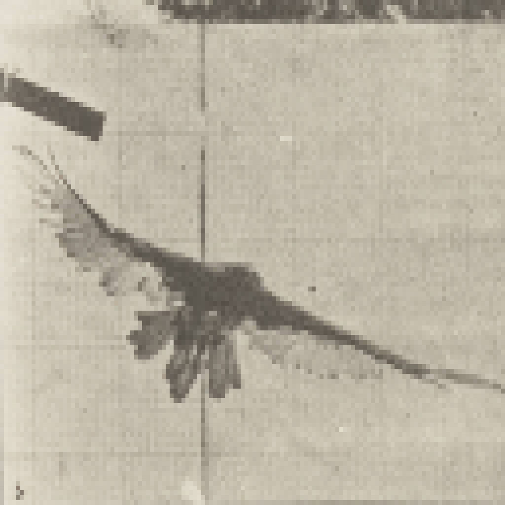

{ align=right width="250" loading=lazy }

Vultures are among the most misunderstood animals on Earth — and among the most important. They are nature's sanitation service: the birds that turn a carcass into clean ground, removing bacteria and pathogens before they get a chance to spread. Their work is worth billions and, as the collapse of vultures in India showed, losing them can cost human lives. Yet across much of the world, these scavengers are quietly vanishing.

<!-- more -->

### Nature's Clean-Up Crew

Vultures are uniquely equipped for their grim but vital job. Their stomach acid is extraordinarily strong — among the most corrosive in the animal kingdom — and their gut microbiome and high body temperature let them safely consume carcasses infected with anthrax, botulism and other pathogens that would kill most animals. They are also remarkably efficient foragers: soaring on thermal updrafts, they can spot a carcass from kilometres away, and a flock can strip a large animal to bone in minutes.

This efficiency is the point. By removing dead animals quickly, vultures stop disease-causing bacteria and pests from multiplying. When they disappear, carcasses linger — and the risks to humans multiply.

### The Services They Provide

Beyond disease control, vultures deliver a bundle of ecosystem services:

- **Pathogen removal.** They neutralise and remove anthrax, botulism and other infections before they reach livestock, water supplies or people.
- **Pest control.** By removing carrion, they starve populations of rats, feral dogs and other pests that feed on rotting remains.
- **Nutrient cycling.** They transform a carcass back into the ecosystem, breaking it down far faster and more cleanly than slow decay.
- **Lower emissions.** Rapid removal means less of the methane and odour of decomposition, and less waste for humans to manage.
- **Cultural heritage.** In India, vultures traditionally fed on sacred cows and, in Zoroastrian tradition, at the Towers of Silence in Mumbai, where the Parsis left their dead to the birds.

### The Indian Vulture Crisis

In the early 1990s, vultures began dying en masse across the Indian subcontinent. The culprit was diclofenac, a cheap non-steroidal anti-inflammatory painkiller widely given to cattle. Vultures that fed on the carcasses of treated livestock died of kidney failure. A population of roughly 50 million collapsed to near zero within a few years — even a fraction of one percent of contaminated carcasses was enough to crash the population. Between the late 1990s and 2007, three species of *Gyps* vultures lost well over 99% of their numbers.

The consequences were devastating and measurable. With no vultures to clean up, carcasses rotted for days; feral dog populations surged by millions, driving a spike in dog bites and lethal rabies infections. Research estimates that the vulture collapse was linked to more than 500,000 additional human deaths over a five-year period in the 2000s. A 2024 study by Eyal Frank and Anant Sudarshan, published in an American Economic Association journal, found that death rates rose by more than 4% in districts where vultures had been abundant, that faecal bacteria in drinking water more than doubled, and that the economic cost of the premature deaths exceeded $69 billion a year. Co-author Eyal Frank put it plainly: "Vultures are considered nature's sanitation service... without them, disease can spread."

### The Threats Facing Vultures Today

The Indian crisis was caused by one drug, but vultures face a long list of pressures: veterinary diclofenac and other vulture-toxic NSAIDs, which are now being sold in Africa; lead poisoning from ammunition fragments in carcasses; deliberate poisoning of predators that also kills scavengers; electrocution on power lines; collisions with wind turbines; habitat loss; and food scarcity where regulations force livestock carcasses to be buried or incinerated. In Africa, several vulture species are now Critically Endangered, and the continent is losing its vultures at an alarming rate.

### What Can Be Done

Because the threats are well understood, so are the fixes. Banning vulture-toxic veterinary drugs and switching to the safe alternative meloxicam has already helped: since the 2006 ban on veterinary diclofenac in India, the decline has slowed and parts of India, Pakistan and Nepal are seeing slow recovery. Alongside that, conservationists are creating vulture safe zones, running captive-breeding and release programmes, providing supplementary feeding at "vulture restaurants," phasing out lead ammunition and protecting nest sites and power lines.

### The Takeaway

Vultures are what ecologists call keystone species: remove them and the whole system sags under the weight of uncollected carrion. The lesson of the Indian vulture crisis is that protecting wildlife is not just about "the cute and cuddly" — every species has a job that affects our health and economy. Vultures may not be beautiful to everyone, but they keep ecosystems — and people — alive. When they thrive, the land stays clean, the water stays safer and the chain of life stays intact.

### Sources

- [BBC News: Indian vultures — decline of scavenger birds caused 500,000 human deaths (July 2024)](https://www.bbc.com/news/articles/c28e2pvzn3lo)
- [Wikipedia: Indian vulture crisis](https://en.wikipedia.org/wiki/Indian_vulture_crisis)
- [BBC Future: Why we should value scavengers (December 2022)](https://www.bbc.com/future/article/20221206-why-we-should-value-scavengers)
- [The Institute for Environment and Resources: Why are vultures dying in Africa?](https://iere.org/why-are-vultures-dying-in-africa/)
- [Vulture Conservation Foundation: Vulture decline in India linked to 500,000 deaths](https://4vultures.org/blog/vulture-decline-in-india-linked-to-death-of-500000-people-study-suggests/)
- [Image: Vulture flying — Wikimedia Commons (Public domain), pixelated](https://commons.wikimedia.org/wiki/File:Vulture_flying_(rbm-QP301M8-1887-767b~6).jpg)
