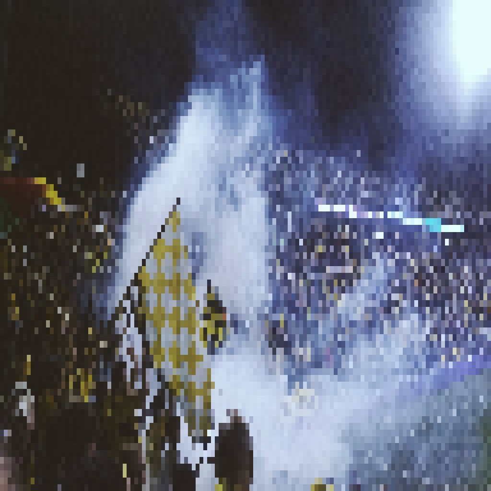

{ align=right width="250" loading=lazy }

NAC Breda — the "Pearl of the South", backed by one of the most passionately loyal fanbases in Dutch football, the Yellow Army — spent the 2025-26 season back in the Eredivisie, only to come straight back down. Now they find themselves in the Keuken Kampioen Divisie for 2026-27, and their chances of an immediate return are among the best in the division. Not because of luck, but because of the budget, the continuity in the dugout and the sheer size of the club. It is a strong position — but not one without risk.

<!-- more -->

### The Road Back Down

NAC had fought their way back to the top flight in the summer of 2025, winning promotion via the play-offs to end a spell away from the Eredivisie. It turned out to be a short-stay visit. Through the 2025-26 campaign the club struggled, finishing in the bottom two and being relegated directly — dropped alongside Heracles Almelo, with FC Volendam coming down through the play-offs. A season that had begun with hope ended in the familiar, bitter return to the second tier.

### The Budget Is the Story

What makes NAC's 2026-27 prospects different from those of most Eerste Divisie clubs is money. According to the published budgets for the Keuken Kampioen Divisie, NAC Breda fields the **largest budget in the entire division** — reportedly the only club with more to spend than Heracles Almelo, whose budget alone stands at €15.5 million. That gives the Breda club a resource advantage over almost every rival, underpinned by a stadium (the Rat Verlegh Stadion, around 20,500 and expanding), an enormous and devoted home crowd, and ownership under the fan-owned association NAC=Breda, which took over the club in August 2022.

Yet the money cuts both ways. AC Breda have repeatedly pointed out that in the Eerste Divisie it is near-impossible to sustain a balanced budget while chasing promotion, and finishing the season with heavy fixed costs can hurt the club's score on the KNVB Financial Rating System. Spring 2026 saw alarming reporting about a potential financial "time-bomb" once the television millions from the Eredivisie disappeared. The biggest budget in the division is an advantage — but it is also a load to carry.

### Continuity in the Dugout

A key piece of the puzzle was settled in May 2026, when NAC confirmed that head coach Carl Hoefkens would stay on for the 2026-27 season. "Ik ben nog niet klaar bij NAC" ("I'm not done at NAC yet"), the Belgian said, with promotion named as the explicit target. Keeping the manager through a relegation is a statement of intent: the club is betting on stability and a group that knows the players, rather than starting over. For a club chasing instant redemption, that continuity can be worth more than a rebuild.

### The Squad Puzzle and the Risks

Relegation always brings departures, and NAC is no exception. Talent is inevitably a target for Eredivisie clubs, and names like Mohamed Nassoh were being linked away as early as spring. The squad has to be reshaped around a promotion push with a league in which margins are razor-thin. The Keuken Kampioen Divisie is a grinding, unforgiving marathon: anyone can beat anyone on a given day, and the teams at the bottom are far less predictable than in the top flight. A big budget and a big stadium count for little if the team cannot handle the smaller sides or the pressure of front-runner status.

### What Their 2026 Chances Look Like

Taken together, NAC Breda enter 2026-27 as one of the clear favourites for automatic promotion. They have the strongest financial base in the division, a manager in place with the explicit goal of bouncing straight back, and a fanbase whose famous "Avondje NAC" atmosphere — the home games that turn into a wall of yellow and black — can genuinely swing matches at the Rat Verlegh. The realistic target is a top-two finish for direct promotion, with the play-offs as a safety net. The main risks are financial sustainability, a squad rebuilding on the fly, and the pressure that comes with being the team everyone wants to beat. If they can translate budget into points and handle the favourites' burden, the Pearl of the South should be back in the Eredivisie very soon.

### Sources

- [Wikipedia: Eerste divisie 2026/27](https://nl.wikipedia.org/wiki/Eerste_divisie_2026/27)
- [Wikipedia: NAC Breda](https://en.wikipedia.org/wiki/NAC_Breda)
- [BetCity: Begrotingen KKD-clubs 2026/27](https://club.betcity.nl/eerste-divisie/begrotingen)
- [BredaNu: Carl Hoefkens ook volgend seizoen hoofdtrainer NAC Breda](https://bredanu.nl/sport/carl-hoefkens-ook-volgend-seizoen-hoofdtrainer-nac-breda-ik-ben-nog-niet-klaar-bij-nac/)
- [Voetbalzone: Carl Hoefkens blijft aan als hoofdtrainer van NAC Breda](https://www.voetbalzone.nl/nieuws/carl-hoefkens-hakt-knoop-door-over-toekomst-bij-nac-breda/blt539a85483f3d4bc0)
- [FootballTransfers: NAC Breda — financiële situatie bij degradatie](https://www.footballtransfers.com/nl/transfernieuws/nl-eredivisie/2026/04/nac-breda-tikkende-tijdbom-financiele-ramp-bij-degradatie)
- [Image: Stadium — Wikimedia Commons (CC0), pixelated](https://commons.wikimedia.org/wiki/File:Stadium-931975.jpg)
