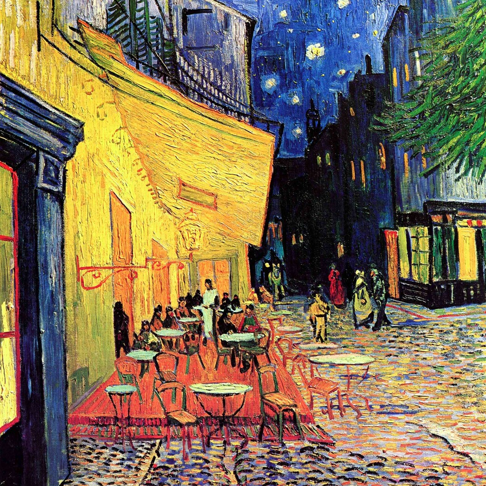

{ align=right width="250" loading=lazy }

In most Dutch cities, a night out has a clear demographic: the party streets skew young, the bars skew trendy, and the people over forty tend to stay home. Breda is different. In this compact, historic Brabant city, the nightlife genuinely seems to be for everyone — teenage students, thirty-somethings and pensioners often end up in the same brown café or at the same terrace, and nobody finds it odd. That cross-generational character is Breda's most distinctive social signature.

<!-- more -->

### A City Built Around the Café

The first thing to know about Breda is that its town centre is unusually small and unusually dense with cafés. Local guides go out of their way to make the point: the centre is compact and the density of drinking establishments is enormous, which makes Breda "the ideal city for a pub crawl" with friends, family or colleagues. In summer the many terraces and hidden inner courtyards spill over with people; in winter the brown cafés are there to warm up in. The Grote Markt — the beating heart of the city — turns from a daytime lunch-and-coffee spot into a buzzing square each evening, with live music frequently setting the mood.

### The Brown Café: Where Generations Meet

What really sets Breda apart is the bruised-brown café (bruine kroeg), a warm, unpretentious institution that functions as the city's collective living room. One much-loved brown café, open for nearly forty years, is described as "the meeting place for young and old": by day you drink a coffee and quietly read a newspaper; by night the same room turns into a quiz hall, a football talk-show studio or a dance club. Another, the De Bruine Pij, pulls in a crowd for specialist beers, live bands on Sundays and a terrace looking out onto the Grote Kerk — an unpretentious atmosphere where everyone immediately feels at ease.

This is the heart of the story. You do not have to choose between a student bar and a quiet pub for the grown-ups, because in Breda they are frequently the same place at different hours. A nineteen-year-old and a seventy-year-old can be at the same table without anyone batting an eye.

### Segmented, but United

Breda is not a monolith — like every Dutch city it has its own rhythms. The Boschstraat tends to draw a younger crowd, the Havermarkt gears up around eleven, and the serious dancing happens in the clubs and late venues like Studio Dependance. There are even guides aimed specifically at where to go out when you are over thirty. But the difference is the overlap: rather than a strip of identikit bars for one age group, the city spreads its venues across a compact core where generations keep crossing paths.

### A Programme That Binds the Ages

The city's calendar reinforces the mix. The Breda Jazz Festival has run since 1971 — four days of jazz, blues, zydeco, Cajun and swing across the centre, and one of the oldest and largest four-day jazz festivals in Europe, drawing hundreds of thousands of visitors and celebrating a crowd "of all ages." It opens on Ascension Day at 1pm on the Grote Markt, and by the weekend the whole city is on its feet. Then there is the football: on a matchday the "Avondje NAC" — the ritual of an evening game at the Rat Verlegh Stadion — fills the cafés with an unusually mixed crowd before and after the whistle, carrying the night on well past full time.

### Why Breda Is Different

Nobody pretends Breda out-parties Amsterdam or Rotterdam, and it is certainly not the place for a blockbuster nightlife-tourist scene. But that is precisely the point. Amsterdam's nightlife leans young and tourist-heavy; Rotterdam's is big and segmented; Breda's is local, small-scale and deeply woven into everyday life. It carries the Brabant "Bourgondische" sense of gezelligheid — an enjoyment of food, drink and company shared across generations — and a university population (Avans and Breda University of Applied Sciences) sitting right on top of a stubbornly traditional local pub culture. The result is a city where going out never ages out, and where the idea of a night out with your parents doesn't seem strange at all.

### Sources

- [seeBreda: De leukste kroegen en mooiste cafés in Breda](https://seebreda.nl/blog-breda/leukste-kroegen-in-breda/)
- [In ons Breda: Gezellige kroegen in Breda](https://www.inonsbreda.nl/gezellige-kroegen-in-breda/)
- [In ons Breda: Uitgaan in Breda — hotspots en tips](https://www.inonsbreda.nl/uitgaan-in-breda-hotspots-en-tips/)
- [Indebuurt Breda: 7 x in deze kroegen ga je uit als je 30+ bent](https://indebuurt.nl/breda/doen/7-x-in-deze-kroegen-ga-je-uit-als-je-30-bent-in-breda~12566/)
- [Breda Jazz Festival](https://www.bredajazzfestival.nl/)
- [Wikipedia: Breda Jazz Festival](https://nl.wikipedia.org/wiki/Breda_Jazz_Festival)
- [Image: Café Terrace at Night by Vincent van Gogh — Wikimedia Commons (CC0)](https://commons.wikimedia.org/wiki/File:Vincent-van-gogh-cafe-terrace-on-the-place-du-forum-arles-at-night-the.jpg)
