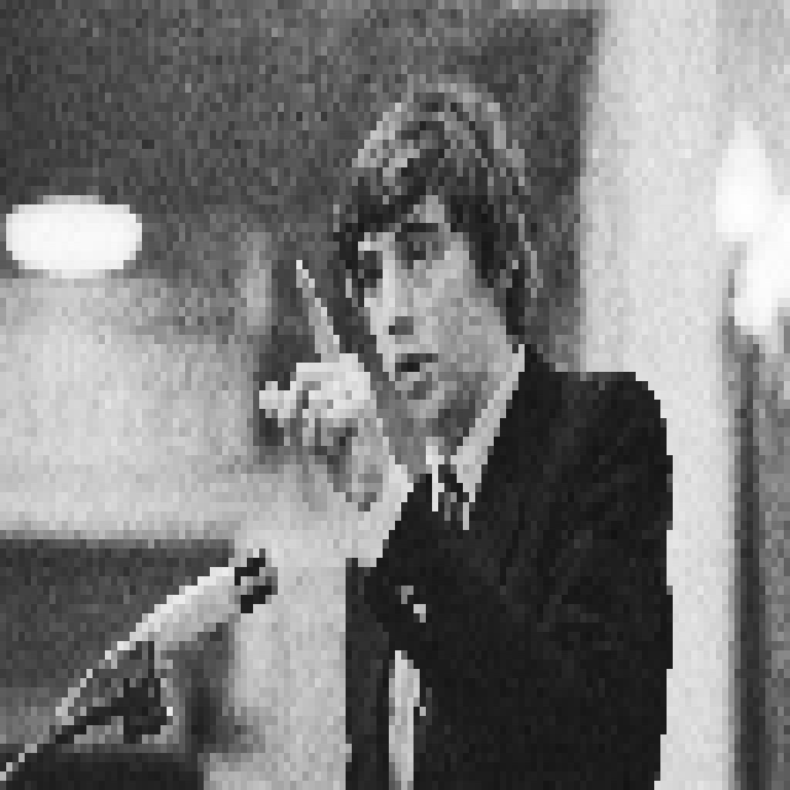

{ align=right width="250" loading=lazy }

In the weekly roundtable from De Nieuwe Wereld (episode #2359, broadcast on Sunday 6 September 2026), host Rogier van Bemmel sits down with publicist Ewald Engelen, journalist Wierd Duk and the lawyer and activist Stan Baggen — who has been campaigning against the bill — to talk about the Wet op de Defensiegereedheid, the drug problem, and whether the Netherlands is quietly slipping away from the rule of law. It is the kind of conversation that asks uncomfortable questions rather than answering them.

<!-- more -->

### The Defense Readiness Act Under Fire

The centrepiece is the Wet op de Defensiegereedheid, the government's bill to prepare the country — and its citizens, businesses and services — for military readiness. The panel is deeply critical. The guest furthest into the weeds describes an "escalation ladder" of coercion: it begins with a voluntary questionnaire, becomes a mandatory one, and ends with citizens being obliged to come for interviews — a slide that critics read as a quiet erosion of privacy and civil liberties. Where the government argues the law is urgent and necessary to keep Dutch troops and society ready for a possible conflict, the guests ask whether the real problem is the size of the army or the state of its readiness — and whether the law is the right tool at all.

### The Netherlands as a Narco-State

The second thread is the drug problem. Drawing on the recent headlines about cocaine and a case the panel insists is being romanticised in the media, the conversation turns into a fight about how the country should think about drugs at all: as a matter of public health or as a criminal-justice one — and the argument that it is both, and that the treat-it-like-tobacco framing is more honest than pretending otherwise.

### The Big Question

Woven through both is a deeper worry: that the rule of law is being traded away in the name of security — and that the same geopolitical narratives framing Russia and Ukraine also serve to normalise a more militarised, less liberal state at home. Whether you agree or not, it is a bracing hour that makes you question how easily the everyday assumptions of a democracy can change.

The full conversation is well worth watching if you want to hear the arguments in full — the legal detail on the act alone justifies the hour.

### Sources

- Original video: [Nederland als Narcostaat, Wet op Defensiegereedheid en het Einde van onze Rechtstaat? | NvdW #2359 (De Nieuwe Wereld)](https://www.youtube.com/watch?v=EGAl0RmrGaM)
- [Overheid.nl: Consultatie Voorstel voor een Wet op de defensiegereedheid](https://www.internetconsultatie.nl/wet_op_de_defensiegereedheid/b1)
- [Raad van State: Advies over Wet op de defensiegereedheid](https://www.raadvanstate.nl/actueel/nieuws/maart/advies-wet-op-de-defensiegereedheid/)
- [Defensiebond: Wet Defensiegereedheid onder vuur](https://www.defensiebond.nl/binnenland/wet-op-de-defensiegereedheid-kabinet-zet-arbeidsrechten-en-vakbondsoverleg-onder-druk/)
- [Image: Tweede Kamer debat — Wikimedia Commons (CC0), pixelated](https://commons.wikimedia.org/wiki/File:Tweede_Kamer_debat_over_kabinetscrisis_VVD-fractieleider_Nijpels_aan_woord,_c,_Bestanddeelnr_932-1584.jpg)
